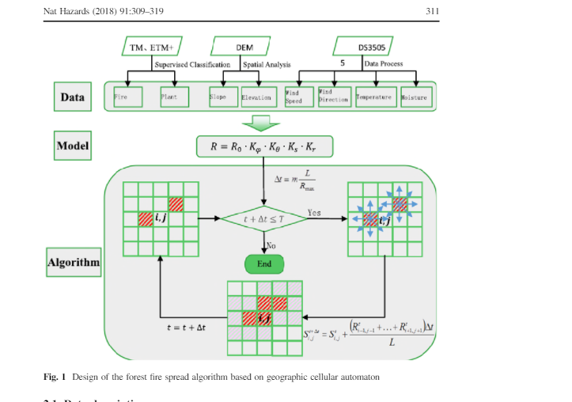
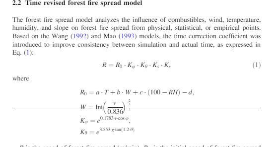
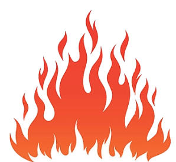
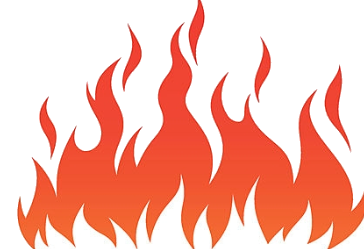
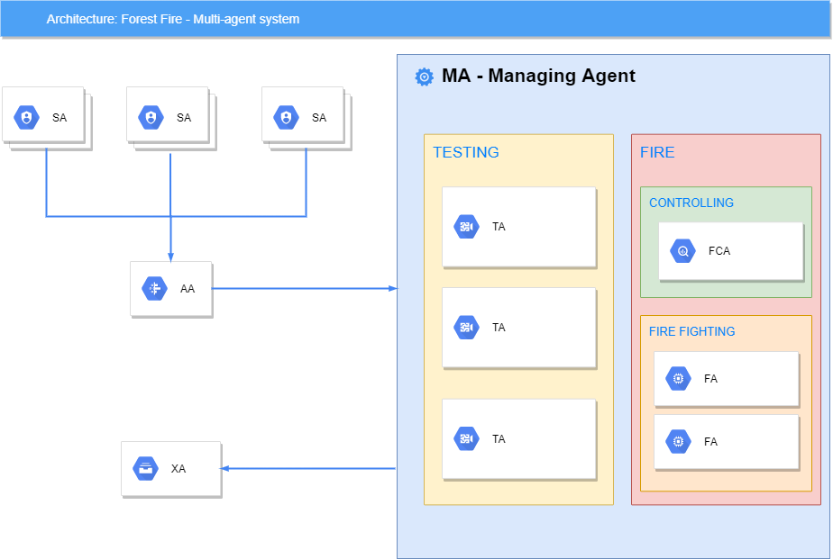
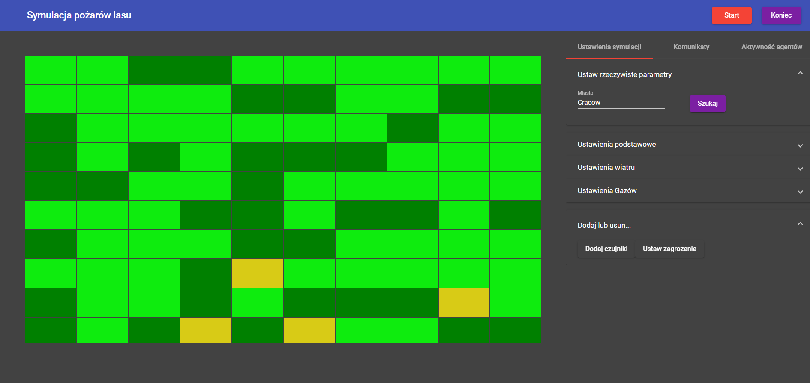
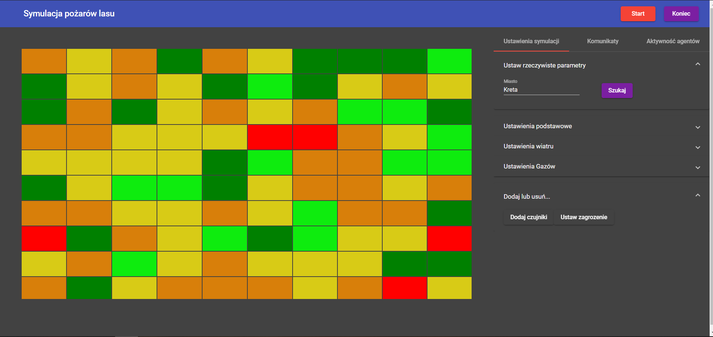
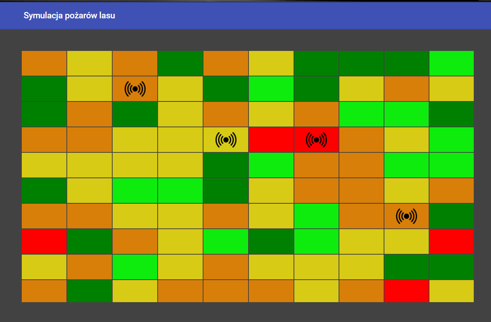
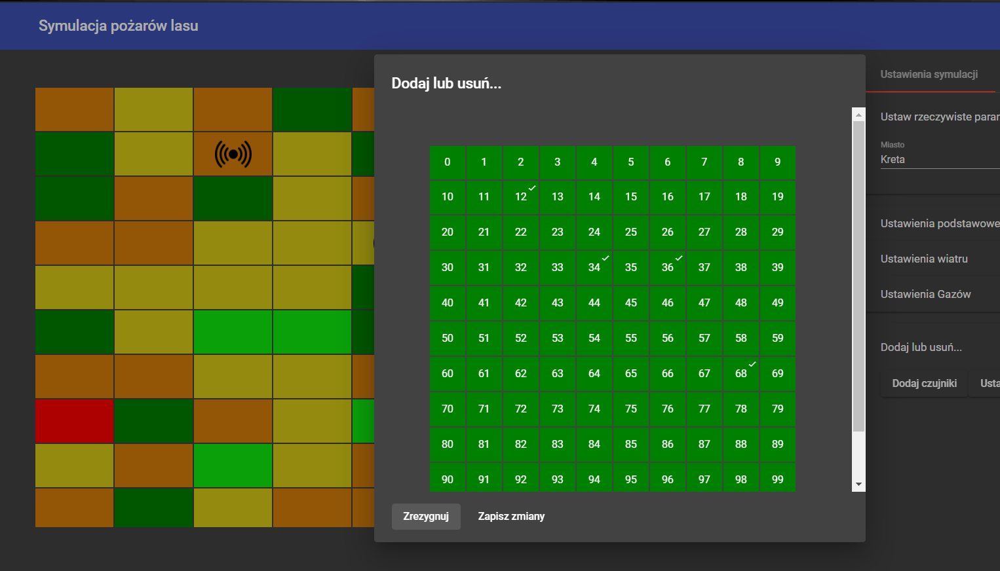

# Agentowa Symulacja Pożarów Lasów

**Akademia Górniczo-Hutnicza**

**Wydział:** Elektrotechniki, Automatyki, Informatyki i Inżynierii Biologicznej

**Kierunek:** Informatyka

**Przedmiot:** Studio Projektowe 1

**Prowadzący:** prof. Radosław Klimek

**Autorzy:**

- Paweł Biłko

- Piotr Krześniak


## Cel przeprowadzenia symulacji

Określenie skutecznego sposobu analizowania czynników ryzyka pożarowego w celu usprawnienia działań gaśniczych i/lub prewencyjnych


## Ocena ryzyka pożarowego

Symulacja opiera się o prostokątną **mapę obszaru**, generowaną na podstawie danych pogodowych ((i geograficznych)). 

Mapa jest podzielona na **sektory** o takich samych, określonych wymiarach. Każdy sektor opisują niezależne informacje pogodowe ((oraz przyrodnicze)).


#### Indeks Zagrożenia Pożarowego McArthura

Na początku symulacji wyliczamy stopień zagrożenia pożarowego w oparciu o wzór McArthur Forest Fire Danger Index, zgodnie z [pracą naukową dot. metod geoinformatycznych w określaniu zagrożenia pożarowego w Polsce](geoinformatics.uw.edu.pl/wp-content/uploads/sites/26/2015/07/TS_v51_05_Wozniak.pdf):

$F=2e^{(-0.45+0.987*log(f_D)-0.0345*H+0.0338*T_c+0.0234*v_w)}$

$f_D$ - współczynnik suszy

$H$ - poziom wilgotności

$T_c$ - aktualna temperatura

$v_W$ - szybkość wiatru


Umożliwia nam to nadanie jednego z **5 oznaczeń** każdemu z sektorów:

1. **Low** [kolor jasnozielony] - oznacza, że po zapłonie ogień w sektorze nie będzie płonął lub będzie płonął tak powoli, że można nad nim bez trudu zapanować
2. **Moderate** [kolor zielony]
3. **High** [kolor żółty]
4. **Very High** [kolor pomarańczowy]
5. **Extreme** [kolor czerwony] - oznacza, że po zapłonie ogeiń w sektorze będzie płonął tak szybko i z tak wysoką temperaturą, że zapanowanie nad nim będzie niemal niemożliwe

System w trakcie działania będzie wykorzystywał indeks McArthura, aby określić tempo rozwoju pożaru na poszczególnych polach według stosunku:

$R = 0.13F$

...gdzie **R** oznacza szybkość rozprzestrzeniania się ognia w km/h, **F** to współczynnik McArthura wyliczony według wzoru podanego wyżej.


## Rozprzestrzenianie się ognia

Model rozprzestrzeniania się ognia opiera się na automacie komórkowym.




Gdzie:
- $R_0$ - początkowa szybkość rozprzestrzeniania się ognia [$m/min$]
- $K_\phi$ - współczynnik wiatru
- $K_0$ - współczynnik terenu
- $K_s$ - indeks palności (stała wartość tabelaryczna)
- $K_r$ - współczynnik korygujący czasu
- $a = 0.03$ 
- $b = 0.05$
- $c = 0.01$
- $d = 0.3$
- $T$ - temperatura [C]
- $W$ - poziom siły wiatru
- $Int$ - ustalona liczba całkowita
- $RH$ - wilgotność powietrza [$\%$]
- $v$ - szybkość wiatru [$m/s$]
- $\phi$ - kąt pomiędzy kierunkiem wiatru, a kierunkiem rozprzestrzeniania się pożaru
- $\theta$ - nachylenie terenu
- $g$ - kierunek nachylenia wzniesienia (1 - pod górę, -1 - w dół)


### Stan płonięcia pola
W modelu mamy do czynienia z 5 poziomami (stanami) płonięcia pola:

0. **Niespalone** 
1. **Wczesny ogień** 
2. **Średni ogień** 
3. **Pełny ogień** 
4. **Ekstremalny ogień** 
5. **Całkowicie zgaszone** 

Stan pola $S$ w chwili $t + \Delta t$ jest obliczany na podstawie stanu pola (oznaczamy jako $S_{ij}(t)$)  oraz jego sąsiadów w chwili $t$.

- $S_{ij}(t) = 0$ - jeżeli istnieje $S = 1$ w sąsiedztwie, to stan pola zostanie obliczony zgodnie ze wzorem $(2)$
- $S_{ij}(t) = 1$ - stan pola wyniesie w następnym kroku: $S_{ij}(t + \Delta t) = 2$
- $S_{ij}(t) = 2$ - jeżeli stany sąsiednich pól są $\ge2$, lub pola nie są palne: $S_{ij}(t + \Delta t) = 3$   
- $S_{ij}(t) = 3$ - $S_{ij}(t + \Delta t) = 4$ 
- $S_{ij}(t) = 4$ - $S_{ij}(t + \Delta t) = 5$ 
- $S_{ij}(t) = 5$ - pole jest zupełnie spalone, a zatem staje się niepalne

Dodatkowo zakładamy, że przejścia pomiędzy stanami trwają tyle samo czasu.

Wzór $(2)$:  $S^{t + \Delta t}_{ij} = S^t_{ij} + \frac{(R^t_{i-1,j-1}+...+R^t_{i+1,j+1})\Delta t}{L}(R^t_{ij}=0)$

Wzór $(3)$:  $\Delta t= m\frac{L}{R_{max}}   (m < 0)$


## Agenci
W celu zaplanowania struktury systemu wieloagentowego głównie kierowaliśmy się zasadą jednej odpowiedzialności, tak aby nigdy nie było więcej niż jednego powodu do modyfikacji klasy. W związku z tym każdy agent wykonuje ściśle określone funkcje oraz zadania, które są  dobrze zdefiniowane i spójne, tak aby funkcjonalności dwóch dowolnych agentów nie miały wspólnej części.


<center><i>Agenci: Rys. 1. Schemat architektury wieloagentowej systemu</i></center>
---


- **SA - Sensor Agent**  - Agent odczytujący dane z czujnika.W przypadku gdy mamy wysokie zagrożenie wystąpienie pożaru przesyła danego do (AA). Ilość agentów zależy od ilości dodanych czujników. 
- **AA - Analyst Agent** - Agent, który po otrzymaniu danych od (SA) je analizuje. Określa prawdopodobieństwo wystąpienia pożaru na danym terenie i przesyła dane do (MA).
- **MA - Managing Agent** - Agent, który po wstępnej statystycznej analizy otrzymanej przez (AA) decyduję się na jedną z 3 możliwości:
	1. pozostawienie terenu bez żadnej reakcji
	2. wysłanie (TA), który oceni stan rzeczywisty terenu
	3. uruchamia (FCA) i  wysłanie (FA), który rozpocznie operacje gaszenia pożaru.

	Ponadto, to on decyduje odnośnie rozmieszczenia agentów (TA) oraz (FA) w terenie. Optymalizuje ilość potrzebnych wyżej wymienionych agentów w zależności od otrzymanych informacji z (FCA).


- **FCA - Fire Controller Agent** - Agent, który w wypadku wybuchu pożaru jest odpowiedzialny za dostarczanie rzeczywistych danych o stanie pożaru do (MA).
- **TA - Tester Agent** - Agent odpowiedzialny za weryfikowanie fałszywych zgłoszeń. Zamiast kosztownej operacji gaszenia pożaru w przypadku otrzymania mało wiarygodnych informacji (MA) ma możliwość wysłania tych agentów, aby zdiagnozowali sytuację.
- **FA - Firefighter Agent** - Agent analizujący stan zdrowia strażaków oraz monitorujący ich lokalizację.
- **XA - Exit Agent** - Agent odpowiedzialny za zapis danych po finalizacji akcji. Raportuje straty spowodowane przez pożar oraz straty wynikające z akcji gaszenia pożaru (np. stan zdrowia strażaków). 

#### Opis współdziałania agentów:

Ilość agentów **SA** zależy od wprowadzonej ilości czujników. Czujniki w naszej symulacji oznaczono czarnym symbolem. Terytoria, które obejmuje zakres czujników są przekazywane do agenta **AA**. Występuje on w pojedynczej ilości, badając i analizując otrzymane dane oblicza prawdopodobieństwo wystąpienia pożaru na każdym polu. Można porównać go do stacji badawczej. Następnie miejsca te, które są w potencjalnym zagrożeniu lub już są pod wpływem pożaru przesyłane są do centrum dowodzenia, które w naszym przypadku nazywa się **MA**. Tutaj, zapada kluczowa decyzja dla każdego terytorium:
- Brak reakcji, pole nie stanowi zagrożenia
- Operacja *TESTING* - wysyłanie **TA**, ilość ich zależy od wielkości terytorium i stopnia zagrożenia. Ich celem jest zbadanie terenu i zweryfikowanie potencjalnego wybuchu pożaru lub zaalarmowanie gdy już takie jest.
- Operacja *FIRE* - utworzenie agenta **FCA** (jeden agent na jeden pożar), który na bieżąco będzie monitorował przebieg pożaru i informował o postępach agenta MA. Ponadto, wysłanie FA, którzy będą badać stan zdrowia strażaków

Po skończonej akcji strażackiej informacje zbiera **XA** i czyści zbędnych agentów.

## Tabela zachowań Agentów

#### Zachowanie Agenta wobec pola o danym stanie zagrożenia pożarowego

| Zagrożenie| SA | AA | MA | TA | FCA | FFA | XA |
| --- | --- | --- | --- | --- | --- | --- | --- |
| ```LOW``` | Zbiera dane z pól i przekazuje do AA|Oblicza zagrożenie korzystając z danych SA|Czeka na zgłoszenie; wysyła **TA** w przypadku zgłoszenia|Wyślij informację czy pole płonie do MA|```delay()```|```delay()```|```delay()```|
| ```MODERATE``` |Zbiera dane z pól i przekazuje do AA|Oblicza zagrożenie korzystając z danych SA; wysyła informację do MA|Czeka na zgłoszenie; wysyła **TA** w przypadku zgłoszenia; wysyła TA w **dużych odstępach** czasu|Wyślij informację czy pole płonie do MA|```delay()```|```delay()```|```delay()```|
| ```HIGH``` | Zbiera dane z pól i przekazuje do AA|Oblicza zagrożenie korzystając z danych SA; wysyła informację do MA|Czeka na zgłoszenie; wysyła **TA** w przypadku zgłoszenia; wysyła TA w **standardowych odstępach** czasu|Wyślij informację czy pole płonie do MA|```delay()```|```delay()```|```delay()```|
| ```VERY HIGH``` oraz ```EXTREME``` | Zbiera dane z pól i przekazuje do AA|Oblicza zagrożenie korzystając z danych SA; wysyła informację do MA|Czeka na zgłoszenie; wysyła **FCA** w przypadku zgłoszenia; wysyła TA w **małych odstępach** czasu|Wyślij informację czy pole płonie do MA|```delay()```|```delay()```|```delay()```|


#### Zachowanie Agenta wobec pola o danym stanie ognia

| *Stan pola* | SA | AA | MA | TA | FCA | FFA | XA |
| ------------ | -------------- | -------------- | --------------------- | ------------------ | ---------- | --- | --- |
| $S_{ij}(t) = 0$ | Przekazuje dane z pól do AA | Oblicza następny stan pola z użyciem danych od SA | ```delay()``` | Wysyła informację zwrotną o **braku** ognia do MA | Wysyła FFA jeżeli $S_{ij}(t + \Delta t) = 1$ w 1. kolejności |Wysyła informację zwrotną o **braku** ognia do FCA; przechodzi w stan **oczekiwania** na dalsze rozkazy|Zbiera informacje o polu do podsumowania|
| $S_{ij}(t) = 1$ | ```delay()``` | ```delay()``` | ```delay()``` | Wysyła informację zwrotną o **obecności** ognia do MA | Przekazuje informacje o stanie pól do MA; wysyła FFA do pola w 2. kolejności |Zostaje na polu do momentu ugaszenia lub otrzymania sygnału do odwrotu od FCA|Zbiera informacje o polu do podsumowania|
| $S_{ij}(t) = 2$ | ```delay()``` | ```delay()``` | ```delay()``` | Wysyła informację zwrotną o **obecności** ognia do MA | Przekazuje informacje o stanie pól do MA; wysyła FFA do pola w 3. kolejności |Zostaje na polu do momentu ugaszenia lub otrzymania sygnału do odwrotu od FCA|Zbiera informacje o polu do podsumowania|
| $S_{ij}(t) = 3 | 4$ | ```delay()``` | ```delay()``` | ```delay()``` | Wysyła informację zwrotną o **obecności** ognia do MA | Przekazuje informacje o stanie pól do MA; wysyła FFA do pola w 4. kolejności |Zostaje na polu do momentu ugaszenia lub otrzymania sygnału do odwrotu od FCA|Zbiera informacje o polu do podsumowania|
| $S_{ij}(t) = 5$ | ```delay()``` | ```delay()``` | ```delay()``` | Wysyła informację zwrotną o **braku** ognia do MA | Zapamiętuje pole jako ugaszone/spalone; jeżeli nie ma już płonących pól kończy akcję gasniczą wysyłając sygnał do MA i wszystkich podległych FFA |Wysyła informację zwrotną o ugaszonym/spalonym polu do FCA; przechodzi w stan **oczekiwania** na dalsze rozkazy|Zbiera informacje o polu do podsumowania|


## Algorytmy działania poszczególnych agentów symulacji

```python
def sendData(Agent a, Data d):
	a.addToQueue(d)

def receiveData():
	return this.popQueue()
```

**Sensor Agent [SA]:**

Input: ForestPixel OR ForestPixel[]

Output:  SensorData: { Temperature t, Wind w, double pressure, double humidity, AirRating ar, PollutionGases pg, ForestPixel fp}

```erlang
loop until receiveData(ExitAgent) == ExitAgent.STOP:
	for each ForestPixel fp:
		if fp.ffi >= threshold_value:
			sendData(AnalystAgent, fp.SensorData)
		else: delay()
end loop
```


**Analysis Agent [AA]:**

Input: SensorAgent[]

Output and side effects: FireDangerMessage, FireDangerIndex (side effect)

```erlang
loop until receiveData(ExitAgent) == ExitAgent.STOP:
	SensorData sd := receiveData()
	FireDangerIndex fdi := calculateFireDangerIndex(sd) 
	sd.forestPixel.setFireDangerIndex(fdi)
	sendData(ManagingAgent ma, AnalystData{FireDangerIndex fdi, ForestPixel fp})
end loop
```


**Fire Controller Agent [FCA]:** 

Input: ForestPixel[\][\] area

Output to MA:  FireStateBoard[\][\] fsb

```erlang
loop until receiveData(ExitAgent) == ExitAgent.STOP:
	for each x, y in area.width, area.height:
		fsb[x, y] := area[x, y].getFireState()
	sendData(ManagingAgent, FireStateBoard fsb)

end loop 
```


**Fire Fighter Agent:**

Input: FireFighter[] fireFighters
Input from ManagingAgent: ForestPixel[] targetPositions

Output to FireFighter: boolean doRetreat, ForestPixel targetPosition
Output to ManagingAgent: boolean[] fireFightersInDanger

```erlang
loop forever:
	// Update firefighter health data

	for each index, ff in fireFighters.enumerate:
		// Mark targetPosition as occupied
		targetPositions.remove(ff.position)

		// Update health
		if ff.inAction == True:
			switch ff.position.getFireState() {
				case Fire.NONE:
					sendData(FireFighter, boolean doRetreat=True)
				case Fire.LOW:
					ff.health -= smallDamage
				case Fire.MODERATE:
					ff.health -= moderateDamage
				case Fire.HIGH:
					ff.health -= highDamage
				case Fire.VERY_HIGH:
					ff.health -= veryHighDamage
				case Fire.EXTREME:
					ff.health -= extremeDamage

				}

		else if ff.inAction == False:
			ff.health += recoveredHealth

		if ff.health < threshold:
			ff.inDanger := True
			fireFightersInDanger[index] := True
		else if ff.health > threshold:
			ff.inDanger := False
			fireFightersInDanger[index] := False	


	// Update firefighter positions
	for tp in targetPositions:
			for ff in fireFighters:
				if ff.position == NULL and not ff.inDanger:
					ff.sendToPosition(tp)

end loop
```


**Managing Agent [MA]:**

Input: AnalystAgent[] aa, FireControllerAgent[] fca, TesterAgent[] ta

Output to FireControllerAgent: TargetPositions[]
Output to ExitAgent: ManagingAgent.FIRE_IS_OVER

```erlang
loop forever:
	if receiveData(AnalystAgent) == FiredangerMessage:
    	for fireDangerIndex in FireDangerMessage:

    		switch fdi {
    			case Danger.LOW:
    				delay()		
    			case Danger.MODERATE:
    				deployAgent(TesterAgent, ForestPixel)		
    			case Danger.HIGH:
    				deployAgent(TesterAgent, ForestPixel)		
    			case Danger.VERY_HIGH:
    				deployAgent(FireControllerAgent, FireFighterAgent)		
    			case Danger.EXTREME:
    				deployAgent(FireControllerAgent, FireFighterAgent)

    		}
    if receiveData(TesterAgents) == TesterAgent.FIRE:
    	deployAgent(FireControllerAgent, FireFighterAgent)
    if receiveData(FireControllerAgent) == FireControllerAgent.FIRE_IS_OVER:
    	sendData(ExitAgent, ManagingAgent.FIRE_IS_OVER)

end loop
```


**Exit Agent [XA]:**

Input: SensorAgent[], AnalystAgent[], TesterAgent[], FireControllerAgent[], FireFighterAgent[], ManagingAgent

Output to all agents: ExitAgent.STOP

```erlang
loop forever:
	if receiveData(ManagingAgent) == ManagingAgent.FIRE_IS_OVER:
		for Agent in AllAgents:
			sendData(Agent, ExitAgent.STOP)
			simulationData.add(gatherData(Agent))
		presentDataAndStats(simulationData)
	else:
		delay()
end loop
```


## Opis użytkowania programu

Po instalacji i uruchomieniu będziemy mogli w panelu webowym aplikacji wyznaczyć szereg parametrów globalnych symulacji, takich jak:

- lokalizacja symulacji (podajemy miasto)

- temperatura w regionie
- wilgotność powietrza
- ciśnienie atmosferyczne
- siła i kierunek wiatru
- stężenie gazów w atmosferze
- rozmieszczenie czujników
- punkt zapłonu pożaru

Po ustaleniu parametrów uruchamiamy symulację.

Do monitorowania symulacji w czasie rzeczywistym mamy dostępne dwa panele: **Komunikaty** i **Aktywność Agentów**

**Komunikaty** zawierają informacje dostarczane przez czujniki w naszej symulacji, które zostały wysłane do Agenta-Analizatora

**Aktywność Agentów** to dziennik wydarzeń z czynności podejmowanych przez poszczególnych agentów w symulacji


## Testy

Kolory oznaczeń na mapie:

1. **Low** [kolor jasnozielony] - oznacza, że po zapłonie ogień w sektorze nie będzie płonął lub będzie płonął tak powoli, że można nad nim bez trudu zapanować
2. **Moderate** [kolor zielony]
3. **High** [kolor żółty]
4. **Very High** [kolor pomarańczowy]
5. **Extreme** [kolor czerwony] - oznacza, że po zapłonie ogeiń w sektorze będzie płonął tak szybko i z tak wysoką temperaturą, że zapanowanie nad nim będzie niemal niemożliwe



<center><i>Testy: Rys. 1. Mapa symulacji dla współrzędnych Krakowa</i></center>
---



<center><i>Testy: Rys. 2. Mapa symulacji dla współrzędnych Krety</i></center>
---



<center><i>Testy: Rys. 3. Mapa symulacji z rozmieszczonymi czujnikami</i></center>
---



<center><i>Testy: Rys. 4. Panel dodawania elementów symulacji</i></center>
---